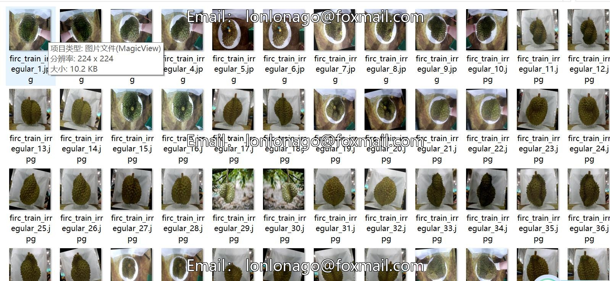
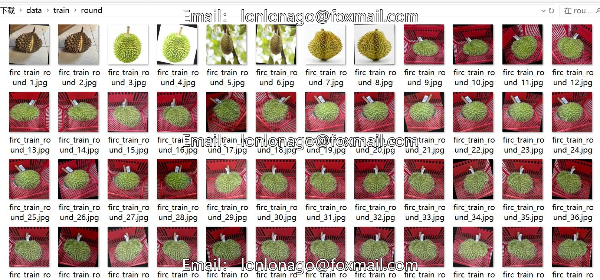
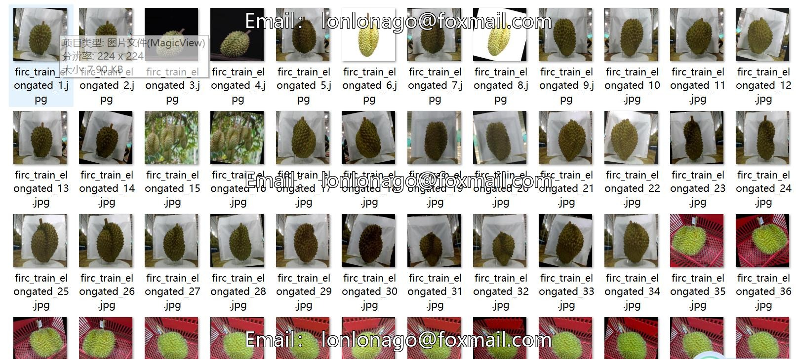

# Intelligent Orchard Mango Size Classification and Mango Shape Shape Classification Dataset: 3314 Images, 4 Categories

Note: Approximately half of the data is rotation-enhanced images.
Dataset Type: Image classification for use, not suitable for object detection without labeled files.
Dataset Format: Only contains JPG images, each category folder contains corresponding images.
Number of Images (JPG File Count): 3314
Number of Categories: 4
Image Resolution: 224x224
Category Names: ['Unlabeled', 'Elongated', 'Irregular', 'Round']
Number of Images per Category:
Training set image count: 2728
- Elongated (Elongated) Training set image count: 828
- Irregular (Irregular) Training set image count: 422
- Round (Round) Training set image count: 544
- Unlabeled (Unlabeled) Training set image count: 934
Validation set image count: 391
- Elongated (Elongated) Validation set image count: 122
- Irregular (Irregular) Validation set image count: 53
- Round (Round) Validation set image count: 82
- Unlabeled (Unlabeled) Validation set image count: 134
Test set image count: 195
- Elongated (Elongated) Test set image count: 61
- Irregular (Irregular) Test set image count: 35
- Round (Round) Test set image count: 41
- Unlabeled (Unlabeled) Test set image count: 58
Total Images Count:
- Elongated (Elongated) Total Image Count: 1011
- Irregular (Irregular) Total Image Count: 510
- Round (Round) Total Image Count: 667
- Unlabeled (Unlabeled) Total Image Count: 1126
Important Note: No special statement made.
Special Declaration: This dataset does not guarantee the accuracy of the trained model or weight files.

## Images

Here is a pay link on Stripe ( https://buy.stripe.com/3cs8yP7sY87d0vu9AB ). Please contact me lonlonago@foxmail.com after funding $89, and I will send you a complete data files , thank you!

